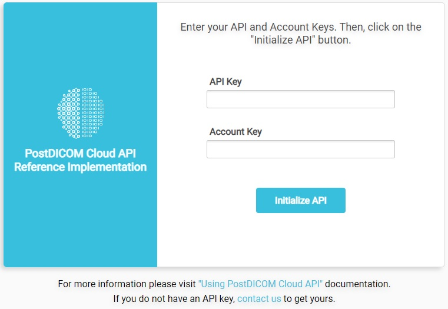
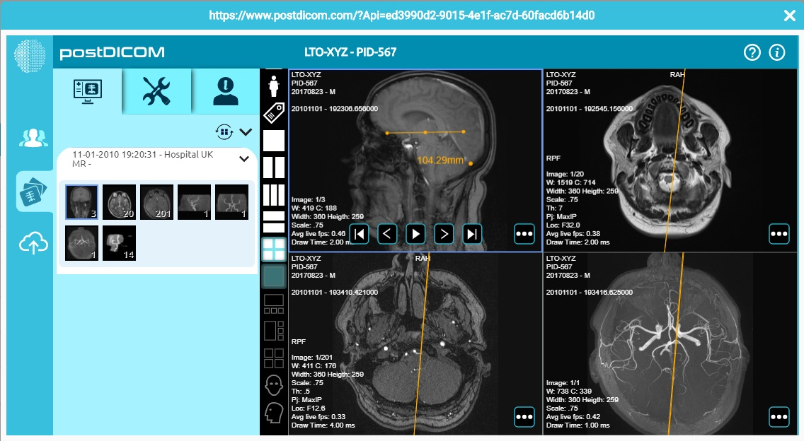

# PostDICOM Cloud PACS API
PostDICOM is a cloud-based software service for archiving and viewing images obtained from medical imaging devices (such as ultrasound imaging, MRI, CT, radiography, nuclear imaging, etc.).

PostDICOM enables all of the regular features of PACS (Picture Archiving and Communication System) – storing, accessing, and sharing your medical imaging files – to be executed within a cloud environment using the DICOM (Digital Imaging and Communications in Medicine) protocol. This eliminates the need for hardware-based storage, lowering your costs and further optimizing your medical imaging archiving system.

# PostDICOM Cloud API Documentation
Software companies can use their own interface to call PostDICOM services through PostDICOM Cloud API calls. These API calls include uploading, searching, viewing and deleting DICOM images and clinical documents. You can reach the API documentation from the <a href="https://www.postdicom.com/en/knowledge-base/api-documentation/using-postdicom-cloud-api">PostDICOM Cloud API Documentation</a> link.

# PostDICOM Cloud API Live Demo
You can reach the live demo from the <a href="https://www.postdicom.com/cloud-api/reference-implementation">PostDICOM Cloud API Live Demo</a> link. Some of the API screenshots are given below. You can customize the user interface and embed into your existing software.

You need to add <a href="https://www.postdicom.com/en/cloud-pacs#pricing">API for Team Plan</a> or <a href="https://www.postdicom.com/en/cloud-pacs#pricing">API for Enterprise Plan</a> to your PostDICOM subscription.

If you have questions or comments, you can contact us from support@postdicom.com.
